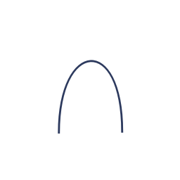
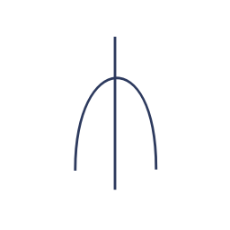

# New-natural-language
我只是想创造新的语言和文字，我希望这种语言能够简单易学，有规律，能够发挥想象力和创造力，不被过去的任何东西所束缚。

这种语言分为发音和文字部分，由于精力有限，我目前优先关注发音，寻找新的发音，我目前可能不使用声调，或者等到更复杂之后使用三个声调，或者4个声调，文字方面，我可能会参考甲骨文，象形文字，文字可能会偏柔软一点。

这种语言是开放的，凡是优秀的想法都会接受，我目前会的语言就只有英、日、中这三种语言，可能会对他们有一些参考，我也不会介意你说的语言，你也可以把它看作是在创造一种外星人使用的语言，当然，你也可以把它看作是金星人使用的语言，或者是日语的进阶版，或者是汉语的进阶版。

# 发音

||aアあ|iイい|uウう|eエえ|oオお|i|u|e|v|nンん|
|:-:|:-:|:-:|:-:|:-:|:-:|:-:|:-:|:-:|:-:|:-:|
|**a**||ai爱|||ao奥|
|**i**|iaヤや||iuユゆ|ie|ioヨよ|
|**w/u**|uaワわ|ui||ue|uoヲを|
|**e**||||||
|**o**||oi|ou欧|||
|**k**|kaカか|kiキき|kuクく|keケけ|koコこ|
|**g**|gaガが|giギぎ|guグぐ|geゲげ|goゴご|
|**s**|saサさ|shiシし|suスす|seセせ|soソそ|
|**z**|zaザざ|jiジじ|zuズず|zeゼぜ|zoゾぞ|
|**t**|taタた|chiチち|tsuツつ|teテて|toトと|
|**d**|daダだ|jiヂぢ|zuヅづ|deデで|doドど|
|**f**|fa发|fi|fuフふ|fe|fo佛|
|**h**|haハは|hiヒひ|hu胡|heヘへ|hoホほ|
|**b**|baバば|biビび|buブぶ|beベべ|boボぼ|
|**p**|paパぱ|piピぴ|puプぷ|peペぺ|poポぽ|
|**m**|maマま|miミみ|muムむ|meメめ|moモも|
|**n**|naナな|niニに|nuヌぬ|neネね|noノの|
|**r**|raラら|riリり|ruルる|reレれ|roロろ|
|**c**||||||
|**r**|ra|ri|ru|re|ro弱|
|**x**||||||
|**j**||||||
|**q**||||||

wi,wo,私,我，ki,ni,君,你，hi,ta,他，win我们，kin你们，hin他们

hi de nu,他出去了

~~这是删除线文字~~
> 这是一个引用块。

`这是行内代码`
[访问我的网站](https://www.example.com)



这是一个脚注示例[^note].
[^note]: 这是脚注内容

<details>
  <summary></summary>
 
</details>

E=mc^2^

```diff
+ 这是绿色文字（代表新增）
- 这是红色文字（代表删除）
! 这是黄色文字（代表修改）
```
